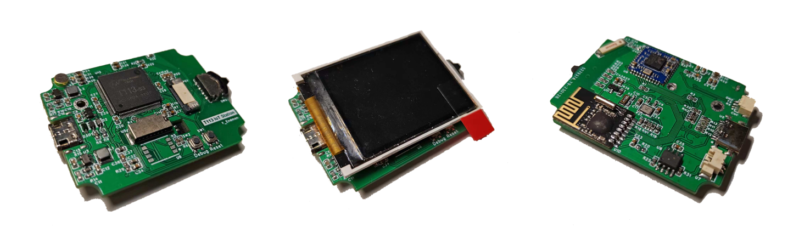
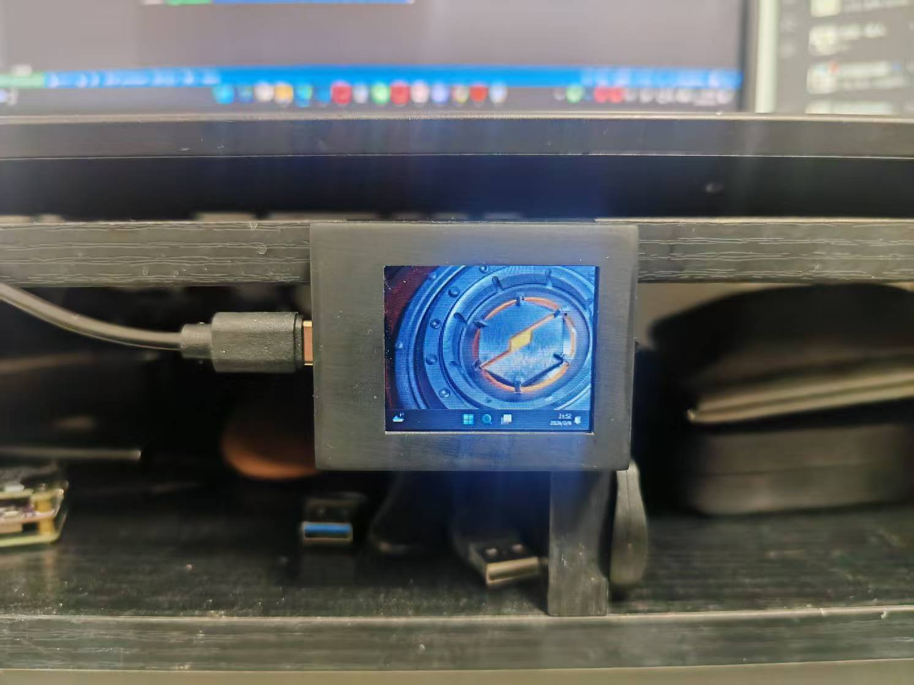

# T113-S3/4板卡Debian系统全套构建支持

## 介绍

本储存库涵盖了bootloader(awboot)、主线linux-6.1、debian根文件系统构建脚本、一键制作镜像与下载脚本。

适用的板卡是我自己搓的T113 IoT Station：




板子带外壳尺寸54\*41\*13，屏幕尺寸1.8寸，内置wifi蓝牙、麦克风扬声器等。

图示应用为windows11 vdd虚拟桌面串流，可以作为电脑副屏使用。

由于有USB RNDIS组局域网，因此日常调试应用可以直接一线通（桌面串流和SSH等）。

本项目其实2022年就基本完成了（当时只上传了内核储存库），一直没有继续整理资料的打算，直到这几天闲下来才继续搞

## 构建

按顺序分别进入以下文件夹参考内部README指引构建各模块：

### awboot

```
cd awboot
make
cd ..
```

### linux-6.1-t113

```
cd linux-6.1-t113
make t113_iot_station_defconfig
make -j$(nproc)
cd ..
```

### debian

```
cd debian
./build.sh
cd ..
```

### 下载

最后进入tools文件夹，根据其内指引完成最终sd卡镜像构建与烧录。

```
cd tools
make build-img
make flash-sd DEV_FILE=/dev/sdX
```
